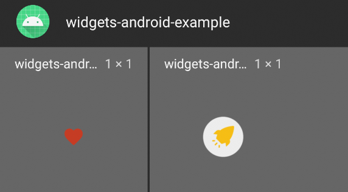

Widgets-Android-Example
=======================

Widgets are an essential aspect of home screen customization. You can imagine them as “at-a-glance” views of an app’s most important data and functionality that is accessible right from the user’s home screen.

Following are the types of widgets you can create using code in this repository:

 1. `Simple Widget` — Called launch-widget, launches the app.
 2. `Broadcast Widget` - Called like-widget, likes/unlikes on tap, shows a toast.

 
